# Vehicle Live Tracking

Architecture presentation · AW Rostamani Group IT · Product Engineering Manager assignment

Hitesh Pachpor · 12 September 2026

<!--
How this file becomes the deck (docs/scripts/build_deck.py):
- "## N. Title" starts a section from the brief. "## Title" without a number is an unnumbered section.
- "### Sub-title" starts a slide. Sub-titles use the brief's numbering (1.1, 1.2, ...). Repeat the same sub-title to continue on another slide.
- Every mermaid diagram is placed on its own full-size slide, in the order it appears.
- HTML comments are not rendered.
-->

## Introduction

### The scenario

AW Rostamani (AWR) works with third-party logistics (3PL) vendors who pick up and drop off customers' vehicles, for example between a showroom and a customer's home.

Once a trip has started, the AWR operations team needs to see where the vehicle is on a map in a web dashboard, and the map should update without refreshing the page.

Each trip involves these roles:

- **AWR Operations** creates trips and tracks them.
- **Vendor Controller** works for the 3PL vendor and assigns each trip to one of the vendor's drivers.
- **Vendor Driver** starts the trip, shares their location while driving, and ends the trip.

The demo data is based in the UAE and uses AWR's automotive brands (Nissan, INFINITI, Renault, Chery and Zeekr).

### The scenario

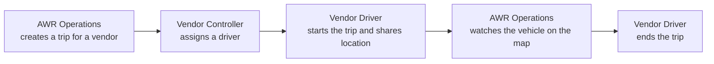

### What the demo version includes

| Requirement from the brief | How it is covered in the demo version |
| --- | --- |
| Trip management API | Trips can be created, listed, viewed, assigned to a driver, started, completed and cancelled. |
| Location ingestion endpoint | `POST /api/trips/:id/location` accepts latitude, longitude, timestamp, and an optional speed and event ID. |
| Live updates without polling | Server-Sent Events (SSE). Updates missed while disconnected are sent again on reconnect. |
| Trip simulator | Runs on the server, follows the driving route from Mapbox, and sends pings through the same location API as a real driver. |
| Data layer | PostgreSQL 17. |
| Active trips list | Trip list with status, search and pagination. It updates live when trips change. |
| Live map view | Mapbox map with a vehicle marker that moves as each ping arrives. |
| Trip timeline | A log of location pings showing device time, received time, speed and source. |
| Vendor simulator panel | The driver can start and stop a simulation and set the update interval and distance per ping. |
| Responsive layout | Works on desktop, tablet and mobile. |

### What the demo version includes

The demo version also includes the following, which the brief did not ask for:

- A separate workspace for each role.
- Rules that stop a driver or a vehicle from being on two live trips at the same time.
- Real GPS from the driver's browser, with an offline queue that holds pings until the network is back.
- Pasting a Google Maps link to fill in the pickup and drop-off locations when creating a trip.
- Docker Compose to run the whole stack with one command, and UAE-based seed data.

Login in the demo version is a simple role switcher, and the APIs are not protected. The brief allows authentication to be covered in the presentation only, and the proposed design is in section 6.

## 1. Use Cases & User Journeys

### 1.1 Vendor driver flow

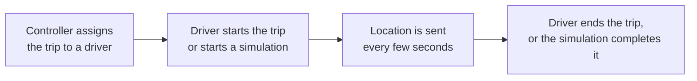

### 1.1 Vendor driver flow

**Live trip**

The driver allows location access in the browser and starts the trip. The browser reads the location every 5 seconds and sends it to the server.

If the network drops, pings are kept in a queue on the device (up to 720 pings) and sent once the connection is back. Each ping keeps its original time and a unique event ID, so a ping that gets sent twice is only saved once.

**Simulated trip**

The driver chooses how often a ping is sent (1 to 60 seconds) and how far the vehicle moves between pings (0.1 to 20 km). The server starts the trip and moves the vehicle along the driving route shown on the map. Each ping goes through the same location API that a real driver uses.

After the last ping at the drop-off point, the trip is completed automatically. If the simulation is stopped early, the trip stays in transit.

### 1.1 Vendor driver flow

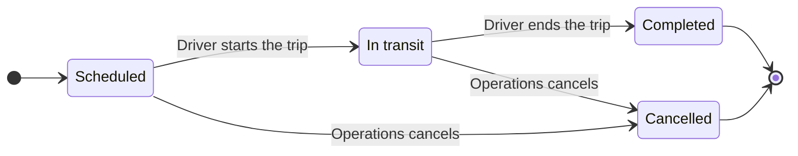

### 1.1 Vendor driver flow

**Trip rules**

- A driver must be assigned before the trip can start.
- Only the assigned driver can start or complete a trip. Operations can cancel it.
- A driver can have only one trip in transit at a time.
- A vehicle can be on only one scheduled or in-transit trip at a time.
- A driver's scheduled trips must be at least three hours apart.
- If two people update the same trip at the same time, the second update is rejected so it does not overwrite the first.

**Timestamps on each ping**

Each ping stores the time the device recorded it and the time the server received it. For example, if a driver loses signal in a basement car park, operations can see that the location was recorded at 14:01 and arrived at 14:04.

### 1.2 AWR operations team flow

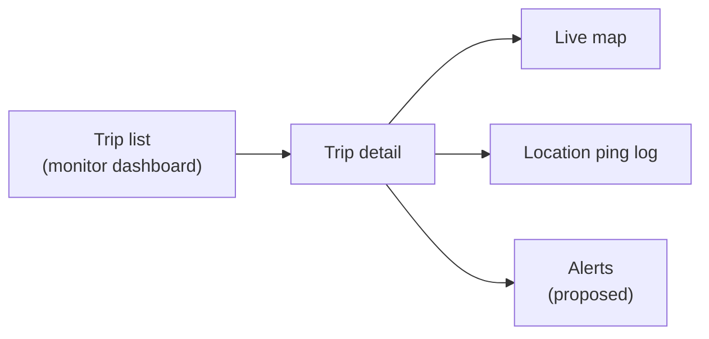

### 1.2 AWR operations team flow

**Monitor the dashboard**

- See all trips, search them, and filter by Scheduled, In transit, Completed or Cancelled.
- The list updates by itself when a trip is created, assigned, started, completed or cancelled.
- Create a trip by choosing a customer, vehicle, vendor, pickup location and drop-off location. A Google Maps link can be pasted in place of an address. The driver is chosen later by the vendor.

**View trip detail**

- Watch the vehicle move on the map, with the last 100 location pings listed beside it.
- See whether the live connection is active.
- Cancel a trip that is scheduled or in transit.
- On a completed trip, the vehicle's last position is labelled "Actual drop-off" when it is 50 metres or more from the planned drop-off point.

Starting, simulating and completing a trip are left to the driver, so operations does not see those buttons.

### 1.2 AWR operations team flow

**Alerts (proposed, not in the demo version)**

| Alert | When it is raised | Who is notified |
| --- | --- | --- |
| Location has gone quiet | No ping for a few minutes while the trip is in transit | Operations, so they can call the vendor |
| Trip not started | The scheduled time has passed and the trip has not started | Operations and the vendor controller |
| Off route | The vehicle is too far from the planned route | Operations |
| Arrived at or left a zone | The vehicle enters or leaves the pickup point, drop-off point or a yard | Operations |
| Drop-off mismatch | The trip ended far from the planned drop-off point | Operations |
| Trip started or completed | The trip status changes | The customer (by SMS) and the CRM |

The first alert to build would be "location has gone quiet". Without it, operations only finds out about a problem when someone notices the marker has stopped moving.

### 1.3 Admin flow

The demo version has no separate admin role. In a 3PL setup, AWR creates the trip and the vendor assigns the driver, so the admin tasks from the brief are split between the existing roles.

| Admin task | Who does it in the demo version | Proposed future version |
| --- | --- | --- |
| Create trips | AWR Operations | Stays with AWR Operations |
| Assign trips to drivers | Vendor Controller | Add rules for reassigning trips and meeting SLA time windows |
| View history | Trip list filters and the location ping log | Longer retention, export and trip replay |
| Manage customers, vehicles, vendors and drivers | Loaded from seed data and read-only | Screens to add and edit these records |
| Manage user access | Demo role switcher | Role management, vendor onboarding and an audit log |

Later on, an admin role would also manage vendor API keys, SLA and geofence settings, and the audit log of who viewed a live trip.

## 2. System Architecture

### 2.1 High-level architecture diagram

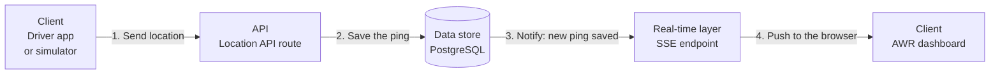

### 2.1 High-level architecture diagram

**Technology stack**

Next.js 16 (App Router), Zod for request validation, Drizzle ORM, PostgreSQL 17, Mapbox for maps and driving routes, Docker Compose, and Vitest with Testcontainers for tests.

**Long-running Node process**

The live connections to the dashboard and the simulator's timer both need a process that keeps running. Serverless functions stop between requests, which would close those connections and stop running simulations.

**Choice of data store**

The brief suggested in-memory storage, Redis or a lightweight database.

- **In-memory storage** is quick to set up, but trip history is lost when the process restarts, and missed updates cannot be sent again after a reconnect.
- **Redis** handles messaging well, but it is less suited to storing trip records and a long history of location pings.
- **PostgreSQL** was chosen. It stores trips and the full ping history, and its unique indexes enforce the trip rules. Its built-in notification feature (`LISTEN` and `NOTIFY`) is used to tell the app when a new ping is saved, so one database covers both needs while the app runs as a single instance.

### 2.2 Justification for real-time mechanism chosen

| | Polling | WebSockets | Server-Sent Events (SSE) |
| --- | --- | --- | --- |
| Direction | The dashboard repeatedly asks the server for updates | Both ways | Server to dashboard only |
| Fit for this dashboard | Adds load, and updates arrive late | Adds a two-way channel the dashboard does not use | Suits a dashboard that only receives updates |
| Reconnecting | Has to be built | Has to be built | Built into the browser |
| Support in Next.js | Simple | Needs an extra library and server setup | Works with a standard streaming response |

SSE was chosen because the dashboard only receives location updates and never sends data back over that connection.

If the connection drops, the browser reconnects by itself and sends the ID of the last update it received. The server then sends every ping saved after that ID, so the trail on the map has no gaps.

The server also sends a small heartbeat every 15 seconds, so proxies and load balancers do not close the connection as idle.

WebSockets would be worth adding if the system later needs to send messages to drivers during a trip.

### 2.3 How location data flows from the vendor interface to the AWR dashboard

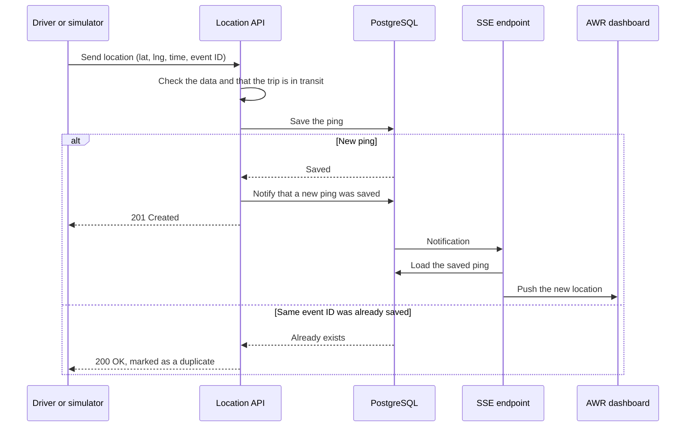

### 2.3 How location data flows from the vendor interface to the AWR dashboard

**Saving a ping**

1. The driver's browser or the simulator sends the location to `POST /api/trips/:id/location`.
2. The server checks the latitude, longitude, timestamp and optional speed.
3. The ping is rejected if the trip is not in transit.
4. The ping is saved. If a ping with the same event ID already exists for this trip, it is not saved again and no notification is sent.

**Showing it on the dashboard**

1. When a trip is opened, the dashboard connects to `GET /api/trips/:id/events`.
2. If the dashboard is reconnecting, the pings it missed are sent first (up to 1,000).
3. After that, each new ping is pushed as soon as it is saved.
4. The map marker moves to the new position, and the ping log shows the latest 100 entries.

Pings from real drivers and from the simulator follow the same path. They are told apart by a `source` field set to `vendor` or `simulator`.

### 2.4 How you would handle scale (100+ concurrent trips)

**Measured capacity of one instance**

The demo version was load tested with k6 on a small server: 1 CPU and 1 GiB of memory for the app, the same for PostgreSQL, and 200 trips in transit.

| Pings per second | Live dashboards | Result |
| --- | --- | --- |
| 40 (200 trips pinging every 5 seconds) | Connected | Every request succeeded. Typical response time was 37 ms |
| 150 (200 trips pinging every second) | 50 | Every request succeeded, and 95% finished within 164 ms |
| 500 | 200 | Almost no errors, but 95% of requests took more than 2 seconds as they queued |

100 trips pinging every 5 seconds is about 20 pings per second, well within what one instance handled.

### 2.4 How you would handle scale (100+ concurrent trips)

**Current design choices that help**

- 20 pings per second adds up to about 1.7 million rows per day. An index on trip and time keeps timeline queries fast at that size.
- The dashboard opens a live connection only for the trip being viewed, so a list of 100 trips does not open 100 connections.

**Limits of a single instance**

- In the load test, the single Node process ran out of CPU at around 500 pings per second, while PostgreSQL and memory still had room.
- The database listener runs inside one process. Users connected to a second instance would not get live updates until they reconnect.
- Running simulations are held in the memory of the process that started them.

### 2.4 How you would handle scale (100+ concurrent trips)

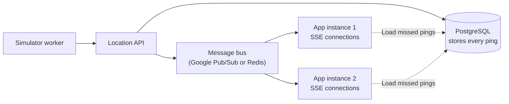

### 2.4 How you would handle scale (100+ concurrent trips)

**Proposed changes for more than one instance**

- PostgreSQL continues to store every ping.
- A message bus such as Google Pub/Sub or Redis takes over from the database notification. Every instance receives every new ping and pushes it to its own connected users.
- The simulator moves to a separate worker, so each simulation runs in one place.
- Old location pings are archived once the history covers many months.

Kafka would be more than this volume needs. Until a second instance is required, a single instance with a health check is enough.

## 3. Integration & Middleware Proposal

### 3.1 API contract design

| Method and path | What it does |
| --- | --- |
| `POST /api/trips` | Create a trip |
| `GET /api/trips` | List trips, filtered by status, vendor or driver |
| `GET /api/trips/:id` | Get a single trip and its current status |
| `PATCH /api/trips/:id` | Assign a driver, or change the status (start, complete, cancel) |
| `POST /api/trips/:id/location` | Send a location ping |
| `GET /api/trips/:id/positions` | Get the recent location pings for a trip |
| `GET /api/trips/:id/events` | Live stream of new pings for one trip |
| `GET /api/trips/events` | Live stream of changes to the trip list |
| `GET, POST, DELETE /api/trips/:id/simulation` | Check, start or stop a simulation |

There are also a few supporting endpoints. They return the customers, vehicles, vendors and drivers used in the forms, convert a Google Maps link into coordinates, and report whether the app can reach the database (health check).

### 3.1 API contract design

**Request example: send a location ping**

```json
{
  "lat": 25.2048,
  "lng": 55.2708,
  "timestamp": "2026-09-10T18:00:00Z",
  "speed": 12.5,
  "eventId": "vendor-message-123"
}
```

**Error response format**

All errors use the same format. Error codes stay the same between releases, so a vendor's app can rely on them.

```json
{ "error": { "code": "DRIVER_NOT_ASSIGNED", "message": "A driver must be assigned before the trip can start.", "details": {} } }
```

**Versioning strategy (proposed)**

- Vendor-facing APIs are published through Apigee under `/api/v1`.
- Within a version, fields can be added but are never removed or renamed.
- A breaking change is released as `/api/v2`, and both versions run side by side while vendors move over.
- The OpenAPI documentation is generated from the existing Zod schemas, so it stays in line with the code.

### 3.2 Webhook or event-driven approach for notifying downstream systems

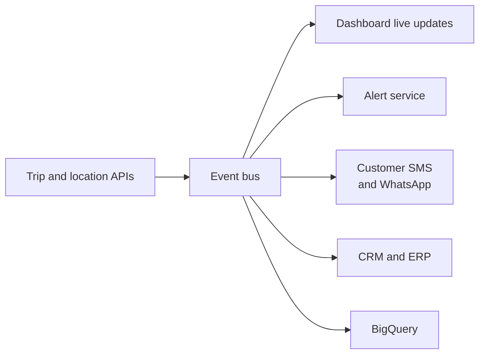

### 3.2 Webhook or event-driven approach for notifying downstream systems

The API publishes an event whenever something happens to a trip, and each downstream system subscribes to the events it needs. If the API called the SMS provider directly, a slow or failed SMS request could delay or break the trip start.

| Event | When it is published | Who would use it |
| --- | --- | --- |
| `trip.created` | Operations creates a trip | Vendor systems |
| `trip.driver_assigned` | The controller assigns a driver | Driver app notification |
| `trip.started` | The trip goes in transit | Customer SMS, CRM |
| `trip.position` | A sample of pings, not every ping | Analytics |
| `trip.stale`, `trip.deviated` | The alert service detects a problem | Operations, vendor SLA reports |
| `trip.completed`, `trip.cancelled` | The trip ends | Customer SMS, ERP job closure, billing |

External systems that cannot subscribe to the bus receive the same events as webhooks. Each webhook is signed so the receiver can check that it came from AWR, and failed deliveries are retried.

### 3.3 Middleware layer considerations

**Already in the demo version**

- Requests that change data are validated with Zod.
- All errors use one format.
- When a request breaks a database rule, the API returns a specific error (409 Conflict or 422 Unprocessable) with a clear code, in place of a generic server error.

**Proposed in the app**

| Area | Approach |
| --- | --- |
| Authentication | Check the user's token or the device's API key on every request |
| Request validation | Keep Zod validation on every request |
| Duplicate requests | Location pings already use an event ID. Trip creation would accept an `Idempotency-Key` header |
| Logging | JSON logs with a request ID, trip ID and vendor ID. Exact coordinates are left out of normal logs |
| Rate limiting | Limit each vendor key on the location API, for example to one ping per second with a small burst allowance |

### 3.3 Middleware layer considerations

**Proposed at the API gateway (Apigee)**

HTTPS, API key checks, usage quotas, separate API products for vendors and AWR staff, and reports on failed requests.

A rate limit inside the app works only while there is one instance. Once there are more, Apigee enforces the limit and the app keeps a basic check as a fallback.

### 3.4 How the system could integrate with AWR's existing operational platforms

AWR's internal system names were not available, so these assumptions were made from public information:

- Customer journeys are managed in a CRM and a dealer management system.
- Vendor jobs are closed and costed in an ERP.
- APIs are published through Apigee.
- Group data is stored in BigQuery.

| Platform | How the tracking system would connect to it |
| --- | --- |
| Apigee | Publishes the location API to vendors, with keys, quotas and HTTPS |
| CRM or dealer management system | Creates trips automatically, for example for a service pickup or a new car delivery |
| ERP | Receives `trip.completed` to close and cost the vendor job |
| Customer notifications service | Receives `trip.started` and `trip.completed` to send SMS or WhatsApp messages |
| BigQuery | Receives trip and location data for SLA reporting |
| Vendor systems | Send GPS pings to the location API |

## 4. Architecture Improvement Proposals

### 4.1 Moving to an event-driven architecture

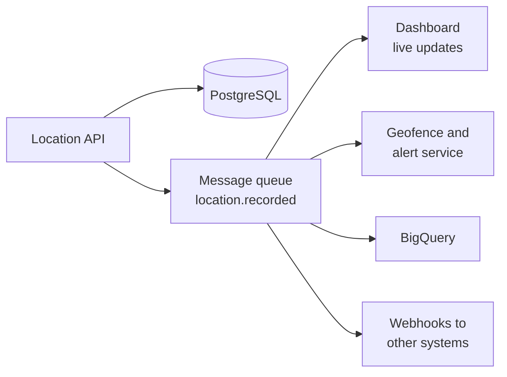

### 4.1 Moving to an event-driven architecture

After a ping is saved, the location API publishes a `location.recorded` event to a message queue. The dashboard, the alert service, BigQuery and the webhook sender each read from the queue separately.

With this in place, a slow or failing consumer has no effect on the location API, and new consumers can be added without changing it. Every app instance also receives every update, which is needed once there is more than one instance.

This change is worth making when a second app instance or a second consumer of location data is added.

### 4.2 Geofencing

Geofencing raises an alert when a vehicle enters or leaves a defined area.

- Each trip gets a circular zone around the pickup and drop-off points, for example with a 150-metre radius. Yards and service centres can have custom shapes.
- A separate service reads new pings from the queue and checks them against the trip's zones, so the location API does not slow down.
- The service raises events such as `trip.arrived_pickup`, `trip.left_pickup` and `trip.arrived_dropoff`.
- Circular zones only need a distance calculation. PostGIS can be added when custom shapes are introduced.

The same zones could be used to complete a trip automatically at the drop-off point and to send the customer an arrival message.

### 4.3 Historical trip replay and route deviation detection

**Trip replay**

Every ping is already stored in order, together with the planned route. Replay would add a timeline slider to a completed trip that moves the marker through the stored pings. Operations could use it when looking into a customer complaint or a dispute with a vendor.

**Route deviation detection**

The system measures the distance between each ping and the planned route. If the vehicle stays further away than a set limit (for example 500 metres) for longer than a set time, a `trip.deviated` alert is raised.

After the trip, the same measurement can show how closely each vendor's drivers follow planned routes. The demo version already does a basic form of this check when it labels the actual drop-off point.

### 4.4 Multi-region or edge deployment for lower latency

The users are in the UAE, so the biggest improvement comes from running the app and database in a Google Cloud region close to the UAE.

- Static files such as JavaScript, CSS and images are served through Cloud CDN. Mapbox serves map tiles from its own global network.
- A single primary database with a read replica is enough. Users are in one country, so writing to databases in several regions is not needed.
- If AWR operates this system in other countries later, each country can have its own deployment, which also keeps location data inside that country.

## 5. Performance Optimizations

### 5.1 Map rendering performance with frequent marker updates

**In the demo version**

- The map is created once and reused.
- The driving route is fetched once per trip, and the map zooms to fit the route once, not on every ping.
- The ping log shows at most the latest 100 entries.
- Map animations are turned off for users who have reduced motion enabled.

**Proposed improvement**

The map markers are currently removed and drawn again each time the trip data changes. At one ping every 5 seconds this is not noticeable. For faster updates, the vehicle marker would be moved to its new position with a short animation, so it glides between points.

### 5.2 Batching vs streaming location payloads

Drivers send pings one at a time as they are recorded, so operations sees the latest position straight away. Pings are sent in a batch only after the device has been offline, when the queued pings are sent together.

The server streams each saved ping to the dashboard as soon as it is saved. If a vendor sent a ping every second, the dashboard could receive a reduced stream, for example one update every 2 to 3 seconds, while every ping is still stored in the database.

SMS, CRM and analytics systems receive trip events and a sample of pings, not every ping.

### 5.3 CDN and asset caching strategy for the web dashboard

| Content | Caching approach |
| --- | --- |
| JavaScript, CSS and fonts | Served through Cloud CDN and cached for a long time. File names change with each release, so users get new files after a deployment |
| Map tiles | Served and cached by Mapbox's own network |
| Pages and API responses | Not cached, because they contain live and user-specific data |
| Live updates (SSE) | Never cached. The `X-Accel-Buffering: no` header stops proxies from holding updates back |

The Mapbox access token can be seen in the browser, so it is restricted to AWR's domains.

### 5.4 Database indexing strategy for location records

**Indexes in the demo version**

- Location pings are indexed by trip and time, so a trip's timeline and latest position load quickly.
- Trips are indexed by status and last update time, so the trip list loads quickly.
- Partial unique indexes enforce one live trip per driver and one active trip per vehicle.
- Event IDs are unique per trip, so the database rejects duplicate pings.

**Proposed as data grows**

- Split the location table by month, so older months can be archived or deleted easily.
- Add PostGIS spatial indexes when geofencing with custom shapes is introduced.

### 5.5 Connection management for WebSocket at scale

The demo version uses SSE, and the same concerns apply.

- Each dashboard opens one live connection for the trip being viewed and one for the trip list.
- A heartbeat every 15 seconds stops proxies from closing connections that look idle.
- The browser reconnects by itself after a drop, and missed pings are loaded from the database.
- When a user closes the page, the server stops sending to that connection and removes it.
- At larger scale, HTTP/2 lets many streams share one connection, and a message bus lets any app instance serve any user (see 2.4).

### 5.6 Server-side rendering vs client-side rendering trade-offs in Next.js

**In the demo version**

The pages are light server components, and data is loaded in the browser. The demo login is stored in the browser, so the server cannot tell who the user is when it renders a page.

**Proposed once real login is in place**

| Part of the page | Where it is rendered | Reason |
| --- | --- | --- |
| Trip header (vehicle, customer, status, driver) | Server | Shows useful content as soon as the page loads |
| First page of the trip list | Server | Shows useful content as soon as the page loads |
| Live map, ping log and live connection | Browser | Changes every few seconds and relies on browser features |

The trip details appear first, and the location history loads and streams in afterwards.

## 6. Security

### 6.1 Authentication (who are you?)

Each type of user signs in differently.

| User | Who they are | Proposed sign-in method |
| --- | --- | --- |
| AWR Operations and Admin | AWR employees | Sign in through AWR's company identity provider using OAuth2 (Authorization Code with PKCE). The session is kept in a secure, HTTP-only cookie |
| Vendor Controller | Vendor staff | Same sign-in method, with each vendor set up separately. The vendor ID is included in the user's token |
| Driver's device | A phone or vendor system sending GPS | A short-lived device token or vendor API key, limited to that driver and their trips. Tokens can be rotated |

**Device keys**

A device only needs permission to send pings for its own trips, so it gets its own key and does not use the dashboard login. If a phone is lost, its key can be revoked without affecting anyone's dashboard access.

**Live connections**

The browser's built-in SSE client cannot add custom headers, so the live connection uses the same secure cookie as the rest of the dashboard. Tokens are kept out of URLs, where they would end up in logs.

**Simulator**

The simulator is turned off in production, or limited to admins with each use recorded.

### 6.2 Authorization (what can you do?)

The server checks every request against the user's role and the vendor or driver named in their token.

| Action | Vendor Driver | Vendor Controller | AWR Operations | Admin |
| --- | --- | --- | --- | --- |
| Create a trip | No | No | Yes | Yes |
| Assign a driver | No | Own vendor's trips | View only | Yes, recorded in the audit log |
| Start, complete or simulate | Own assigned trips | No | No | Emergency use only |
| Send location | Own in-transit trip | No | No | No |
| Cancel a trip | No | No | Yes | Yes |
| View trips and live map | Own trips | Own vendor's trips | All | All |
| Manage master data, API keys and SLAs | No | View own drivers | View | Yes |
| Replay and export history | No | Own vendor's trips | Yes | Yes |

The demo version applies these rules in the browser only. In production the server runs the same checks. A request without a valid login gets 401 Unauthorized, and a request for another vendor's or driver's trip gets 403 Forbidden.

A vehicle's live location is sensitive, so each time someone views it, the view is recorded in an audit log.

### 6.3 Data in transit

- All traffic to the dashboard and APIs uses HTTPS (TLS 1.2 or higher), and HTTP requests are redirected to HTTPS.
- The SSE stream runs over the same HTTPS connection. If WebSockets are added for drivers later, they use secure WebSockets (WSS).
- The app connects to the database over an encrypted connection inside a private network.
- Tokens are never put in URLs, so they do not show up in server or proxy logs.

### 6.4 Data at rest

- Cloud SQL encrypts the database, its backups and its replicas. AWR can manage the encryption keys if required.
- Coordinates are not encrypted field by field, because the system needs to query them to draw maps and calculate distances. Access to the database is restricted instead.
- Only the app's service account can read location data. Staff access to the database is limited and logged.
- Detailed location history is kept for a fixed period, for example 90 days, and then deleted or kept only as summaries.
- Customer contact details have the same access controls, and exact coordinates are left out of normal application logs.

### 6.5 API abuse prevention

The location API receives traffic from outside AWR, which makes it the most exposed part of the system.

| Control | What it protects against |
| --- | --- |
| Input validation | Invalid coordinates, timestamps and speeds are rejected before they reach the database (in the demo version) |
| Unique event IDs | A retried ping is not saved twice (in the demo version) |
| Trip must be in transit | Pings cannot be sent to a trip that has not started or has already ended (in the demo version) |
| One live trip per driver | The same driver cannot be active on two trips (in the demo version) |
| Rate limiting per device | A device or key cannot flood the API. About one ping per second is plenty for a vehicle |
| Anomaly detection | Flags impossible speeds, sudden jumps in location, and repeated failed logins |
| Device tokens and gateway quotas | Only registered devices can send pings |

## 7. Analytics

### 7.1 Operational metrics

| Metric | How it is calculated |
| --- | --- |
| Trip duration | Time from trip start to trip completion, compared with the planned time |
| Average speed | Average and 95th percentile speed from the location pings |
| Delay frequency | Share of trips that started late or arrived later than the route estimate |
| Route efficiency | Distance actually driven compared with the planned route distance |
| Tracking quality | Number of trips where the location went quiet or the drop-off point did not match |

### 7.2 System health

| Metric | What it shows |
| --- | --- |
| API response time (95th percentile) | Whether the location API is slowing down |
| Error rate by error code | Whether vendors are sending bad data or the system is failing |
| Ping delay (time received minus time recorded) | Whether drivers are losing signal or pings are arriving late |
| Live connection stability | Number of open connections, reconnects and dropped connections |
| Uptime | Results of the health check endpoint |

### 7.3 Business metrics

| Metric | What it shows |
| --- | --- |
| SLA compliance per vendor | Share of trips that met the agreed pickup and drop-off times |
| On-time pickup and drop-off rate | How reliable each vendor is |
| Route deviation rate per vendor | How often drivers leave the planned route |
| Trip volume by vendor, brand and emirate | Where more vendor capacity is needed |
| Cost per completed trip | Vendor cost, once the ERP is connected |

### 7.4 Tools

| Purpose | Tool | Reason |
| --- | --- | --- |
| Data warehouse | BigQuery | AWR's group data is already stored there |
| Loading data into the warehouse | Pub/Sub and Dataflow | Streams trip events into BigQuery without adding load to the app |
| Operational and business dashboards | Looker or Looker Studio | Vendor SLA scorecards and operations reports |
| System health | Google Cloud Monitoring and Logging | Response times, errors and dropped connections, with alerts |
| Product usage | Google Analytics 4 (optional) | How the dashboard is used, for example how long it takes to create and assign a trip |

Mixpanel or a similar product analytics tool is not needed at the start. It can be added later if AWR already uses it elsewhere.

## 8. Testing Strategy

### Approach by layer

| Layer | Approach | Covered in the demo version | Proposed next |
| --- | --- | --- | --- |
| Unit tests | Core business logic | Trip status changes, driver availability rules, request validation, route and distance calculations, the offline ping queue, and role access | Add tests with each new feature |
| Integration tests | API routes and the live connection lifecycle | API handler tests, and tests against a real PostgreSQL database (using Testcontainers) for database rules, duplicate pings and database notifications | HTTP tests against a running server |
| Component tests | UI components with React Testing Library | Not covered yet | Trip list, driver assignment and live connection status |
| E2E tests | Playwright: trip simulation and live map update | The main trip journey in Chrome, from signing in to ending the trip | Cancelling, search and filters, role access, tablet layout, Firefox and WebKit |
| Performance tests | Load test of the location API (k6 or Artillery) | k6 load test of the location API and live connections on a 1 CPU, 1 GiB server | Run nightly against staging, on servers sized like production |

### Approach by layer

**Focus of the tests**

Unit and integration tests cover issues that are hard to spot by using the app, such as a driver being put on two trips at once or a ping being saved twice after a retry. The Playwright tests check that the main journey works in a real browser, and the k6 test shows how much traffic one instance can take.

**When each type of test runs**

- Every pull request runs lint, type checks, unit tests and a production build. These commands already exist in the project.
- Integration tests need Docker, so the CI pipeline runs them in an environment where Docker is available.
- End-to-end tests run against a preview environment before changes reach staging.
- Performance tests run nightly against staging, so they do not slow down pull requests.

### E2E tests

Playwright tests cover the key user stories of the main trip journey, in Chrome.

**Key user stories**

1. As Operations, I sign in so I can open the operations trip workspace.
2. As Operations, I create a trip for a customer's vehicle, with a vendor and the pickup and drop-off locations.
3. As a vendor controller, I assign a driver to that unassigned trip.
4. As a driver, I start a simulated journey so the vehicle sends its location.
5. As Operations, I watch those pings arrive live on the trip, in the ping log and as a map marker when it appears.
6. As a driver, I end the trip so it is no longer in transit.

**Out of scope**

Cancelling a trip, search and filters, Google Maps link import, live browser GPS and the offline queue, a wrong password, the role access rules, tablet layout, and the Firefox and WebKit browsers.

### Performance tests

**Test setup**

- The app and PostgreSQL were each limited to 1 CPU and 1 GiB of memory, similar to one small server.
- 200 trips were already in transit, kept separate from the demo data.
- k6 ran in its own container with no limits, so it did not take CPU away from the app.
- About 1 in 10 pings reused an event ID, so duplicate retries were part of the traffic.
- 50 live connections were opened during the 150 pings per second run, and 200 during the run up to 500 pings per second.
- The 150 pings per second run passed only if fewer than 1% of requests failed and 95% finished within 200 ms. It ran for 5 minutes, and was then increased step by step to 500.

The tests ran on Docker Desktop, whose limits are close to a small Google Cloud server but not identical, so the results are a guide for one instance.

### Performance tests

**Results**

| Pings per second | Live dashboards | Response time (95% of requests) | What happened |
| --- | --- | --- | --- |
| 40 | Connected | Typical response 37 ms | Every request succeeded, and the CPU was about a quarter busy |
| 150 | 50 | 164 ms | Every request succeeded. Memory stayed under 320 MiB. Dashboards received about 33 updates per second, in order |
| 300 to 500 | 200 | More than 2 seconds | Almost no errors. The CPU was fully used and requests waited in line |

**What the results show**

- One instance of this size can hold 150 pings per second, which is 200 vehicles pinging every second.
- The limit is the single Node process and its 10 database connections. PostgreSQL, memory and disk still had room.
- Under heavy load the app slows down and keeps accepting pings, so operations would see the marker lag behind.

## 9. Deployment Strategy

### 9.1 Hosting platform for Next.js

AWR already runs digital products on Google Cloud, so the proposal is to host this system there too.

| Option | Assessment |
| --- | --- |
| Vercel | Very good Next.js support. Its functions are short-lived, though, so long-running live connections, the database listener and the simulator would need to run somewhere else. It would also be one more platform to manage |
| AWS | Would work technically, but adds cost and effort if AWR's other platforms are on Google Cloud |
| Google Cloud (GKE and Cloud SQL) | Supports long-running processes and uses platforms AWR already has |

Cloud Run could also work, as long as at least one instance is always running and the simulator runs in a separate worker. Without those two changes, idle instances would shut down and drop live connections.

### 9.1 Hosting platform for Next.js

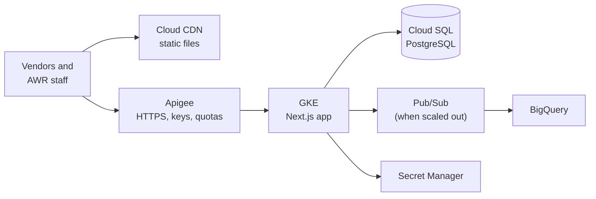

### 9.2 CI/CD pipeline design

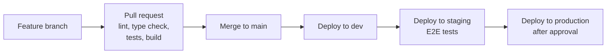

### 9.2 CI/CD pipeline design

**Branch strategy**

Feature branches are kept short and merged into `main` through pull requests. `main` is kept ready to deploy at all times, and production releases are tagged.

**Automated tests**

Every pull request runs lint, type checks, unit and integration tests, and a production build. The Playwright tests then run against a preview environment. The k6 load test runs nightly against staging, and a Terraform plan is added once the infrastructure is defined in code.

**Staged rollout**

Each release goes to dev first, then staging, then production. Production deployments need approval and are rolled out gradually. New features, such as extra location fields, are released behind feature flags so they can be turned off without a new deployment.

With a single instance, a deployment briefly drops live connections. Browsers reconnect by themselves and load the pings they missed, so no data is lost. With two or more instances, a rolling update avoids the drop.

### 9.3 Environment management

| Environment | Data | Used by |
| --- | --- | --- |
| Local | Docker Compose with seed data | Engineers |
| Dev | Shared Google Cloud project with test data | Engineers, for integration work |
| Staging | Close to production, with anonymised data and no real customer locations | AWR IT and operations, for user acceptance testing |
| Production | Real vendors and trips, stricter access, simulator turned off | Restricted access |

- Each environment has its own Google Cloud project, database and API keys.
- Secrets are stored in Secret Manager, not in code or Docker files.
- Seed data and demo passwords are used only locally and in dev.

### 9.4 Monitoring & alerting

| Signal | Starting threshold | Action when exceeded |
| --- | --- | --- |
| Uptime (health check) | 99.9% | Alert the on-call engineer |
| Location API response time (95th percentile) | Under 200 ms | Alert if it stays above the threshold for 5 minutes |
| Location API error rate | Under 0.1% | Alert the on-call engineer |
| Live connection drop rate | Alert if reconnects rise sharply | Check proxies and load balancers for closed or buffered connections |
| Trips with no recent location | Tracked as a product metric | Alert operations and check the vendor and the location API |
| Conflicting trip updates | Expected to be rare | Investigate a sudden increase, as it usually points to a bug |
| App CPU usage | Under 80% | Add an instance or a larger server. In the load test, requests started to queue once the CPU was fully used |

The 200 ms response time target is the same one used in the k6 load test, where one instance stayed within it at 150 pings per second.

Google Cloud Monitoring and Logging cover the platform, and an error tracking tool covers the Next.js app. The `/api/health` endpoint is used for both the uptime check and the Kubernetes health check.

### 9.5 Infrastructure as Code considerations

All infrastructure is defined in Terraform and reviewed through pull requests in the same way as application code. This includes:

- GKE cluster and app deployment
- Cloud SQL database and backups
- Access roles (IAM) and service accounts
- Secret Manager
- Apigee API products
- Cloud CDN and load balancer
- Pub/Sub topics
- Monitoring alerts and dashboards

Dev, staging and production are then created from the same definitions, with no manual setup in the console.

Terraform is the default choice because it is widely used and well supported on Google Cloud. Pulumi would also be fine if the team already uses it.

## What would be done differently with more time

### What would be done differently with more time

| In the demo version | With more time | Reason it was deferred |
| --- | --- | --- |
| Demo role switcher and open APIs | Real sign-in, device tokens and server-side access checks | The brief allows authentication to be covered in the presentation only |
| Database notifications within one process | Message bus (Pub/Sub or Redis) | One instance was enough to run the full flow end to end |
| Simulations held in the app's memory | A separate simulator worker | The simulator is a tool for demos and testing |
| Unit, integration and k6 load tests, and Playwright tests for the main journey | Component tests, more E2E scenarios, and nightly load tests on servers sized like production | The data rules, live updates and the main journey were tested first |
| No downstream notifications | `trip.started` and `trip.completed` events and webhooks | There were no real SMS or CRM systems to connect to |

### What would be done differently with more time

| In the demo version | With more time | Reason it was deferred |
| --- | --- | --- |
| Data loaded in the browser | Trip details rendered on the server | Needs real sign-in first |
| API without a version number | `/api/v1` behind Apigee, with OpenAPI documentation | No external vendors were using the API yet |
| Map markers redrawn on each update | Vehicle marker moved with a short animation | Not noticeable at one ping every 5 seconds |
| No alerts | "Location has gone quiet" and "trip not started" alerts | The live tracking flow was built first |
| No CI pipeline configured | CI pipeline running the existing lint, type check, test and build commands | Checks were run locally during development |
