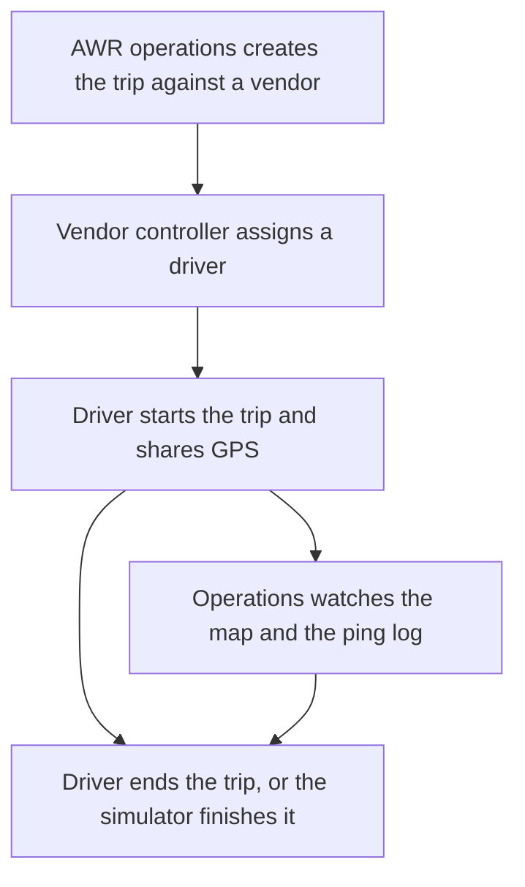
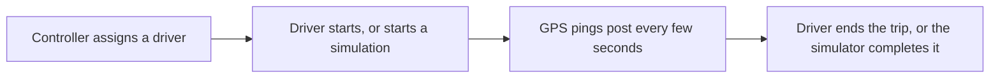
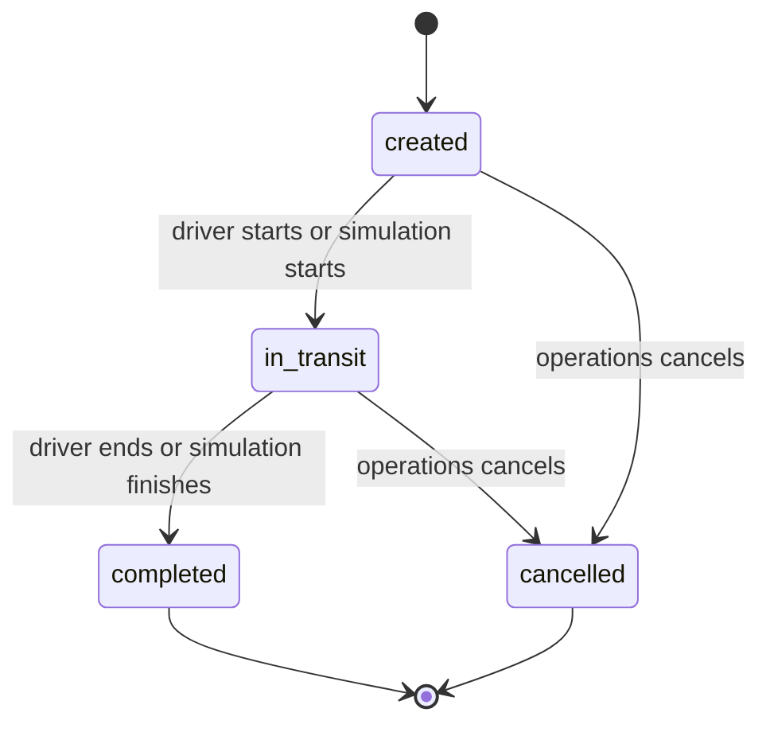
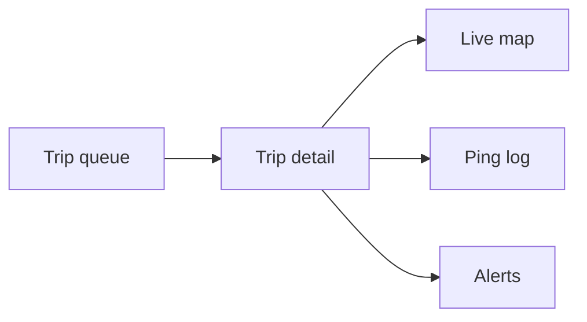
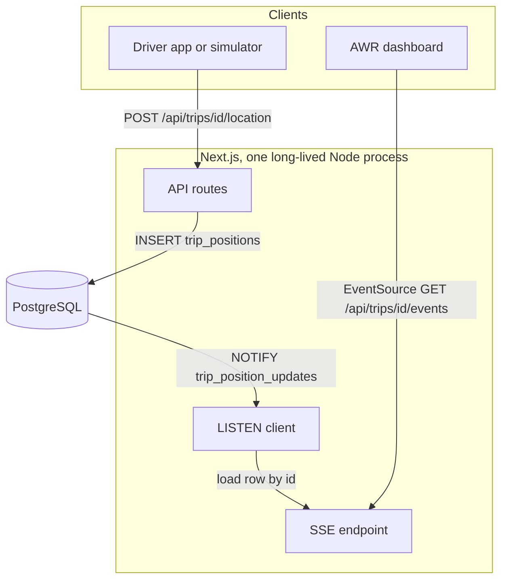
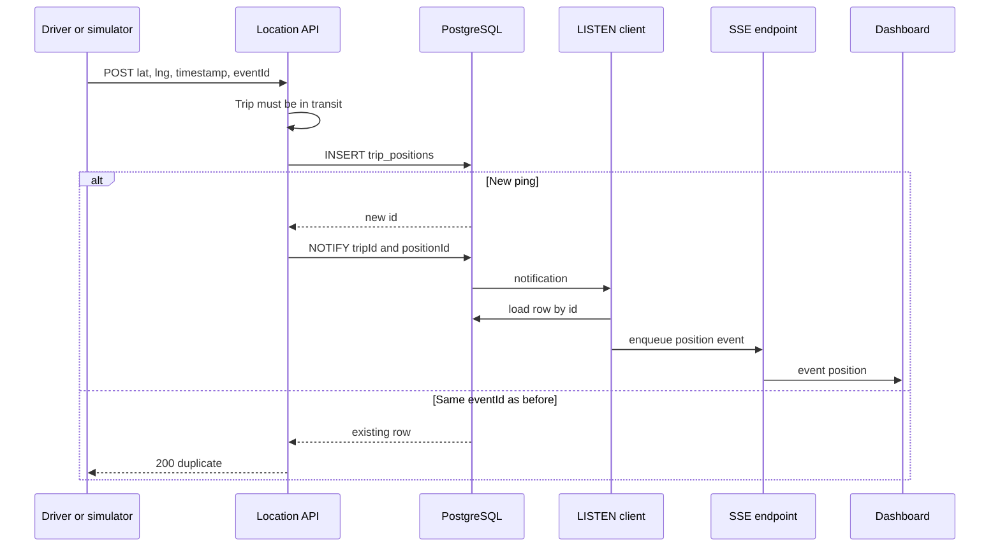
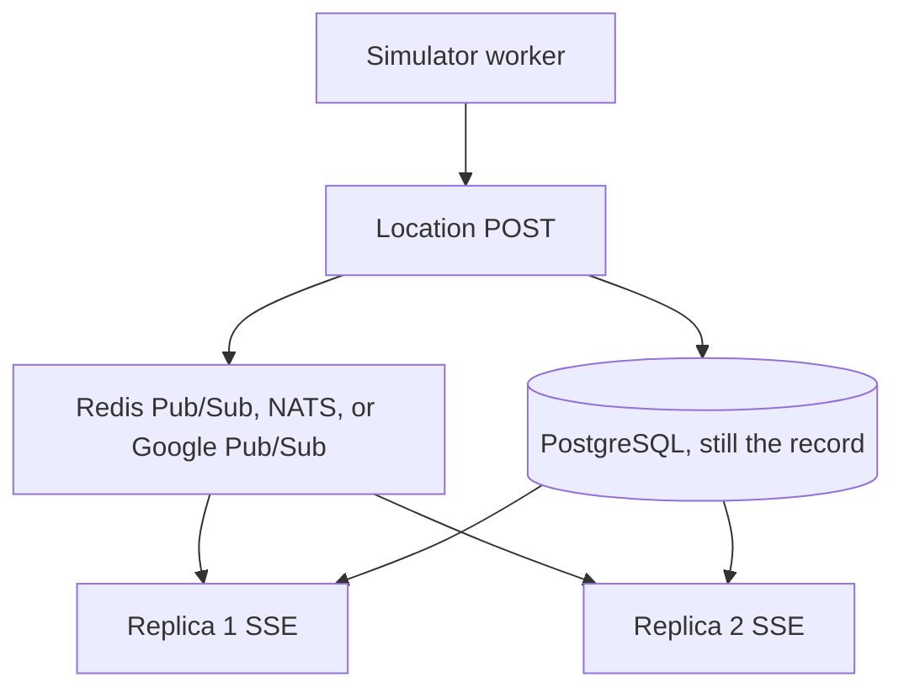
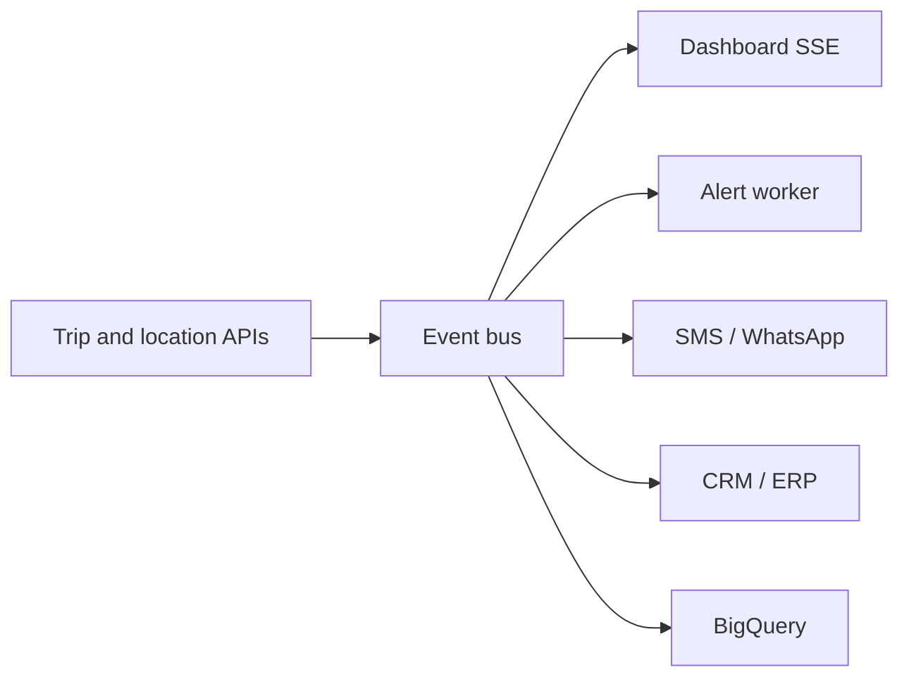
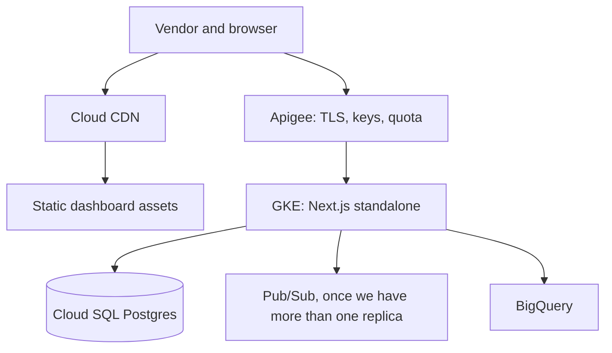
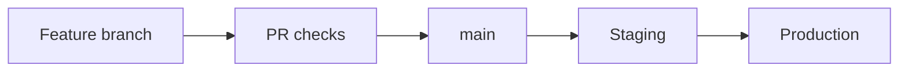

# Vehicle live tracking

Architecture presentation · AW Rostamani Group IT · Product Engineering Manager assignment

<!-- This file is the deck: slide title, what goes on the slide, a mermaid diagram where one helps, then a talking track in normal spoken language. -->

---

## 1. Vehicle live tracking 

****

AW Rostamani Group IT

Product Engineering Manager assignment

Hitesh Pachpor · 12th September 2026

<!-- Seven-day working slice, plus how I would take it to production -->

<!--
**Talking track**

Thanks for having me. I spent the week on a live tracking system for vehicles that logistics vendors pick up and drop off for AWR. I'll walk through who uses it, how the software is put together, and what I would change before this sat in front of a real vendor. After the slides I can show the running app.
-->

---

## 2. What we're solving

AWR works with third-party logistics vendors who handle vehicle pick-up and drop-off for customers. Once a trip is underway, operations needs to see where the vehicle is, on a web dashboard, without refreshing.

Three people are in that loop:

- AWR Operations, who create and track trips
- A 3PL Vendor Controller, who assigns trips to one of its drivers and tracks them
- A 3PL Vendor Driver, who starts/completes trips and shares location while the trip is active

The demo data is set in the UAE.

<!--
**Talking track**

This is a pretty familiar operations problem. A customer's car is with a vendor, and the desk in AWR needs a live picture of that job. I treated it as a logistics handoff, with a showroom at one end and a home address at the other. The seed data uses Nissan, INFINITI, Renault, Chery, and Zeekr because those are AWR's automotive brands, and it keeps the demo feeling like your world.
-->

---

## 3. How the three journeys fit together



I decided to split creation of a trip and assigning it to a driver. AWR Operations creates the job. The vendor picks the driver. That matches how a 3PL handoff would work.

<!--
**Talking track**

If you put the driver on the create form, it looks like AWR is dispatching the vendor's staff. I didn't want that. Operations opens the job against a vendor, the vendor controller assigns someone from their roster, and the driver is the one who starts sharing location. I'll come back to admin in a couple of slides, because the brief asked for that journey separately.
-->

---

## 4. What has been built

| What's in the brief | What's in the repo |
| --- | --- |
| Trip APIs | Create, list, get trips · Assign a driver · Start, complete, cancel a trip |
| Active trips list | Queue with status, search, pagination |
| Location ingest | `POST` with lat, lng, timestamp, optional speed, optional `eventId` |
| Live updates without polling | SSE, with Postgres `LISTEN` / `NOTIFY`, and replay after a reconnect |
| Live map | Mapbox, marker moves as pings arrive |
| Trip timeline | Ping log with device time, received time, speed, source |
| Simulator | Runs on the server, follows the Mapbox driving route, posts through the same location API |
| Simulator controls | Driver starts and stops, sets interval and distance per ping |
| Datastore | PostgreSQL 17 |
| Responsive layout | Works well on all viewports |

I also added a few things: three workspaces, occupancy rules so a driver or vehicle isn't on two live jobs, real browser GPS with an offline outbox, Google Maps link import on new trip, Docker Compose, and UAE seed data.

Login in the app is a persona switcher. The password is `password`, the session lives in the browser, and the APIs are open. The brief said auth could stay in the presentation so I didn't implement it considering the tight timeline.

<!--
**Talking track**

I used the week to get a full loop working: create a trip, assign a driver, move a vehicle, and watch it on the map. The extras are there because a dashboard needs list filters, lookups, and a way to start a trip. I'll be clear as we go about what is running today and what I'm proposing for production. Auth is the main one. I didn't put a fake JWT on open APIs.
-->

---

## 5. Vendor driver journey



**Live trip**

The driver allows location, starts the trip, and the browser samples GPS every 5 seconds. Pings sit in an outbox if the network drops, then POST to `/api/trips/:id/location` with the original device timestamp and a stable `eventId`. The outbox keeps up to 720 pings.

**Simulated trip**

The driver picks an interval between 1 and 60 seconds, and a step between 0.1 and 20 km. The server starts the trip, follows the same Mapbox driving route the map draws, and posts through the same location service. After the last drop-off ping it completes the trip. Stopping the simulation leaves the trip in transit.

Only the driver can start or complete. Operations can cancel.



A few rules sit on those transitions: a driver has to be assigned before start, one in-transit trip per driver, one active trip per vehicle, a three-hour gap on scheduled work, and an optimistic `version` on updates so two people editing at once don't silently overwrite each other.

I store two times on every ping. `recorded_at` is what the device said. `received_at` is when we accepted it. If a driver was in a basement, operations can see that the phone thought it was 14:01 and we got it at 14:04.

<!--
**Talking track**

The simulator is doing the same job as a phone. I didn't animate the marker in the browser. The Next.js process walks the route and posts GPS the way a vendor device would. That's the bit I want to show in the walkthrough, because it proves the ingest path, the database, and the live stream together. Offline was worth building even in a week. Drivers go through parkades. The outbox keeps the original timestamp so a late flush doesn't look like a new ping.
-->

---

## 6. Operations journey



**What you can do today**

- See every trip, search, filter by Scheduled, In transit, Completed, Cancelled
- Create a trip: customer, vehicle, vendor, pickup and drop-off. You can paste a Google Maps link. You don't pick a driver here
- Open a trip and watch the map and the last 100 pings
- Cancel a scheduled or in-transit trip
- See whether the live stream is connected
- On a completed trip, if the last ping is 50 metres or more from the planned drop-off, the map labels it as the actual drop-off

Operations cannot start, simulate, or complete a trip.

<!--
**Talking track**

Day to day, operations lives on the queue and then opens a trip that's in trouble. The map and the ping log are in the app now. The alerts column is the next product slice, and I wanted it on this slide because the brief called it out. Stale location is the one I'd build first. If a car hasn't pinged in ten minutes, the desk needs to know before they notice the marker has gone cold.
-->

---

## 7. Alerts

The brief's operations flow includes alerts. I didn't implement it, but here's what I would implement:

| Alert | Trigger | Recipients |
| --- | --- | --- |
| Stale location | No ping for a few minutes while in transit | Operations can call the vendor |
| Not started | Scheduled time has passed and the trip is still created | Operations and the vendor controller |
| Route deviation | Vehicle is too far from the planned line | Operations, and later customer comms |
| Geofence | Entering or leaving pickup, drop-off, or a yard | Arrival and departure |
| Drop-off mismatch | We already hint at this at 50 metres | Exception handling |
| Trip started / completed | Status change | Customer SMS, CRM |

<!-- ## 7. Admin journey

The brief asked for create, assign, and history. I put those with Operations and the vendor controller for this slice. A dedicated admin role still makes sense later.

| Ability | Built currently | Future extension |
| --- | --- | --- |
| Create trips | Operations | Operations stays the desk |
| Assign drivers | Vendor controller | Rules for reassignment, SLA windows |
| History | Queue filters and the ping log | Retention, export, replay |
| Customers, vehicles, vendors, drivers | Read-only lookups, loaded by seed | Full master data |
| Access | Demo personas | Role admin, audit log, vendor onboarding |

Later admin work I'd want: vendor API credentials, SLA and geofence config, support impersonation, an audit of who opened a live trip, and export. -->

<!--
**Talking track**

I didn't make a fourth workspace this week. Creating a job and configuring the system are different jobs, so I left Operations as the desk and kept admin for later. Location is also sensitive. If someone on the support team opens a live map, I'd want that in an audit log. That's admin work, and it can wait until the desk flow is solid.
-->

---

## 8. System architecture



Stack: Next.js 16 App Router, Zod, services and repositories, Drizzle ORM, PostgreSQL 17, Mapbox GL and Directions, Docker Compose, Vitest with Testcontainers.

The service runs as a long-lived Node process. SSE connections and the simulator timer need the process to stay up.

Postgres stores the trips and the pings, and it also carries the wake-up through `LISTEN` / `NOTIFY`. That works for a single instance service built for this assignment.

The location POST and the open SSE connections are not coupled. The POST writes a row and the system notifies. If nobody has the dashboard open, the ping is still there. If the tab reconnects, we replay from the table.

I looked at an in-memory store, Redis as the system of record, and pushing straight from the POST handler. History and replay die if the process restarts on an in-memory store. Redis is a good bus and a weaker place to keep trip state and an append-only log. Pushing from the POST handler ties vendor traffic to whoever happens to be watching.

<!--
**Talking track**

The picture to keep is: the phone writes a row, Postgres taps the process on the shoulder, SSE reads that row and sends it to the browser. I kept those steps apart on purpose. The row is what we trust. The notify can be missed, and that's fine, because reconnect replay comes from the table. I'll talk about what happens with a second replica in the scale slide. For this week, one process is the honest shape.
-->

---

## 9. Why I used SSE

The brief allowed WebSockets or SSE, and ruled out polling.

| Parameter | Polling | WebSockets | SSE |
| --- | --- | --- | --- |
| Direction | Dashboard keeps asking | Both ways | Server to dashboard |
| Fit for operations | Extra load, feels laggy | More machinery than a map needs | Matches “push locations to whoever is watching” |
| Reconnect | We'd write it | We'd write it | Browser sends `Last-Event-ID` |
| In Next.js | Easy | Extra client and an upgrade path | Native stream on the Node runtime |

I went ahead with SSE. The dashboard only listens. `EventSource` reconnects on its own and sends `Last-Event-ID`. Missed rows are replayed from `trip_positions.id`. The stream sends a heartbeat every 15 seconds + `X-Accel-Buffering: no` so a proxy doesn't buffer it.

WebSockets are a better option if we would want the system to also communicate back with the drivers, but for this demo I didn't consider that use case.

<!-- On HTTP/1.1 each tab is its own connection. If we ever had a wallboard of many trips, I'd look at HTTP/2 or a small gateway, or one stream that carries several trip ids. -->

<!--
**Talking track**

Polling would have been the fastest thing to code, and it wouldn't have met the brief. Between the two push options, the dashboard is a listener, so SSE was the smaller fit. The free reconnect was the part I cared about. People refresh, laptops sleep, and I didn't want a gap in the trail. If someone asks why not WebSockets, my answer is I'd use them on the vendor device later, and leave the map on SSE.
-->

---

## 10. How a location ping gets to the map



**Storing location pings:**

1. POST `/api/trips/:id/location`
2. Validate lat/lng, timestamp, optional speed, optional `eventId`
3. Reject if the trip isn't in transit
4. Insert. If that `eventId` already exists for the trip, return 200 with `duplicate: true` and skip the notify
5. `recorded_at` is the device time, `received_at` is our clock

**Sharing location data with Operations:**

1. GET `/api/trips/:id/events`
2. Subscribe for that trip
3. Replay rows with `id` greater than `Last-Event-ID`, up to 1000
4. Hold any notifies that arrive during replay, then send them
5. The browser keeps the last 100 pings and moves the marker

Browser GPS and the simulator both write the same table, with `source` set to `vendor` or `simulator`, and the map doesn't know the difference between them.

<!--
**Talking track**

If you remember one flow from this talk, this is it. A ping is saved first. The live stream is a reader of that save. Retries are safe because of `eventId`. A vendor with a flaky connection can POST the same ping twice and operations won't see the car jump. When I demo, I'll say the marker is moving because this path ran, not because the front end is interpolating a fake route.
-->

---

## 11. A hundred trips at once

A hundred in-transit trips, pinging every 5 seconds, is about 20 writes a second and about 1.7 million rows a day. Postgres is comfortable there, with an index on `(trip_id, recorded_at, id)`.

Twenty operations users each watching one trip is twenty SSE connections. That's fine on one Node process.

A wallboard of a hundred trips is a different shape. Today I only stream the trip you have open, so we don't open a hundred streams for one screen.

What doesn't hold up if we start a second replica today:

- The `LISTEN` client lives on one process
- The simulator timers live in a map in memory
- `NOTIFY` isn't stored, which we already accept because replay covers a missed wake-up on one instance

How I would grow it:



Keep Postgres as the source of truth. Publish the wake-up to a bus. Each replica fans out to its own SSE clients. Move the simulator to a worker so only one place owns the clock. Archive old positions when history is measured in months.

I wouldn't bring in Kafka for a hundred trips. I'd add a bus when I add a second instance. Until then, one GKE pod with `/api/health` as the probe is enough.

<!--
**Talking track**

The brief asked about a hundred concurrent trips, so I did the arithmetic. Twenty writes a second is easy for Postgres. The part I worry about is open SSE connections, plus the LISTEN client and simulator timers that live in one process. I already documented that two containers would split the simulator and could miss a live notify. Reconnect would fill the gap from the table, and the marker would look jumpy. So the production story is: one replica until we have a bus, then two.
-->

---

## 12. API contract

```text
POST   /api/trips
GET    /api/trips?status=&vendorId=&driverId=
GET    /api/trips/:id
PATCH  /api/trips/:id          { status } or { driverId }
POST   /api/trips/:id/location { lat, lng, timestamp, speed?, eventId? }
GET    /api/trips/:id/positions
GET    /api/trips/:id/events   text/event-stream
POST   /api/trips/:id/simulation
```

Lookups for the forms: customers, vehicles, vendors, drivers. Maps link resolve. Health check.

Errors look like this, with a stable `code` a vendor app can branch on:

```json
{ "error": { "code": "DRIVER_NOT_ASSIGNED", "message": "...", "details": {} } }
```

The assignment API has no `/v1` prefix. For a vendor-facing API I would put it behind Apigee as `/api/v1`, only add fields inside a version, and cut a v2 if we ever break something. Webhook payloads would get their own version, CloudEvents is a simple choice. OpenAPI would come from the Zod schemas we already have.

<!--
**Talking track**

The three endpoints in the brief weren't enough to drive the screens, so the list grew. The error codes are the part I'd keep stable: `TRIP_NOT_IN_TRANSIT`, `CONCURRENT_MODIFICATION`, `DRIVER_NOT_ASSIGNED`. Versioning can wait until a real vendor is integrating. I wouldn't ship them an unversioned URL.
-->

---

## 13. Events and AWR's other systems

I wouldn't send SMS from the trip `PATCH` handler. I'd emit an event and let other systems subscribe.



| Event | When | Who might listen |
| --- | --- | --- |
| `trip.created` | Operations creates | Vendor portal |
| `trip.driver_assigned` | Controller assigns | Driver app push |
| `trip.started` | Status becomes in transit | Customer SMS, CRM, Subscribe Me or a service booking |
| `trip.position` | Sampled, not every ping | Downstream analytics |
| `trip.stale` / `trip.deviated` | Alert worker | Operations inbox, vendor SLA |
| `trip.completed` / `trip.cancelled` | Terminal states | SMS, ERP job close, billing |

I haven't been given AWR's internal system names. Publicly, the group already runs automotive journeys through CRM and ERP, uses Apigee for APIs, and uses BigQuery as a data lake. I'd map the real names in week one.

| Platform | How this app would meet it |
| --- | --- |
| Apigee | The URL vendors see: keys, quotas, TLS |
| Dealer CRM / DMS | Where the job starts: service loaner, delivery, subscription |
| ERP | Close the vendor job and cost it |
| Customer comms | Start and arrive messages, through a notifications service |
| BigQuery and Dataflow | Trip and position facts for SLA |
| Vendor systems | They POST GPS to us |

<!--
**Talking track**

The SMS example in the brief is a good one, and the failure mode is calling a messaging vendor from inside our status change. I'd publish `trip.started` and let a notifications service do the rest. Same for CRM. GIT already has Apigee and BigQuery, so I'd use those. I don't want a second reporting path sitting beside them. I want to be upfront that the system names here are inferred from what's public. I'm happy to redraw this once I have the real catalogue.
-->

---

## 14. Middleware

Two layers. Things the app should do, and things the group gateway should do.

**In the repo today:** Zod on every write, one error shape, Postgres unique and foreign-key errors mapped to 409 and 422. No auth, no rate limit, no request id, `console.error` on 500s.

**In the app I would add:**

| Concern | Approach |
| --- | --- |
| Auth | Check a JWT or API key |
| Validation | Keep Zod where it is |
| Idempotency | Already on location; add `Idempotency-Key` on create |
| Logging | JSON logs with a request id, trip id, vendor id. No raw coordinates at info level |
| Rate limit | Per vendor key on `/location`, something like 1 per second with a small burst |

**On Apigee:** TLS, key checks, quotas, separate products for vendors and AWR staff, PII rules, analytics on ingest errors.

A rate limit only inside Next.js is fine while we have one instance. At group scale I'd put it on the gateway and still check in the app.

<!--
**Talking track**

When the brief says middleware, I read two things: request hygiene, and the integration layer GIT already owns. Zod is the hygiene we have. Apigee is the layer I'd put in front of vendors. I wouldn't make Next.js the only place a quota lives.
-->

---

## 15. After this slice

**Event-driven location path.** After we save the row, publish `location.recorded`. SSE, alerts, BigQuery, and webhooks all listen. I'd do this when we add a second instance, or when a second consumer shows up.

**Geofencing.** A radius around pickup and drop-off, maybe 150 metres, and optional yard shapes. A worker on the position stream, not extra logic in the POST. I skipped PostGIS this week because we had no geofence. Circles can start with a distance check.

**Replay and route deviation.** We already have an append-only log, so replay is a slider over `trip_positions` plus the stored route. Deviation is how far a point sits from that line. Useful live, and later as a vendor score. The 50 metre drop-off hint is a small version of this.

**Running close to users.** People using this are in the UAE. GKE and Cloud SQL should live in a nearby region, with Cloud CDN in front of static assets. I wouldn't multi-master Postgres for GPS pings. Edge belongs on tiles and JavaScript.

<!--
**Talking track**

These are the four the brief asked for, and they're all natural extensions of what we already store. The geofence and the replay both want the position log we have. The event bus is the same move I described for a second replica. Multi-region, for this product, is mostly “put the database near Dubai,” not a global write path.
-->

---

## 16. Performance

**Map updates.** One Mapbox instance, route fetched once, bounds fitted once, marker updated on each ping. Reduced motion is respected. Right now the marker is recreated when the trip object changes. That's fine at one ping every 5 seconds. If we ever took a ping a second, I'd move the existing marker and maybe interpolate so it doesn't jump. I wouldn't refit bounds on every ping. The ping list is already capped at 100.

**Batching and streaming.** Ingest stays one ping per POST. Vendors already have an outbox, and batching on the way in hides stale data. The dashboard gets one SSE event per saved row. If a vendor ever sent a ping every second, I'd thin that out for the map and still keep every row in the table. SMS and CRM should get samples.

**CDN.** JS, CSS, and Mapbox tiles can be cached. The HTML for a trip page is personal, so I wouldn't cache that at the CDN. Cloud CDN in front of `_next` assets, and Mapbox already CDNs tiles. The Mapbox token is public and should stay URL-restricted.

**Server render vs client render.** The pages are thin Server Components. The dashboard loads data in the browser, because auth is in `localStorage` today. The live map should stay on the client. After real auth, I'd render the trip header on the server so the first paint has a vehicle and a status, then stream positions in the browser. I wouldn't wait on a hundred pings before showing the page.

Indexes we already have: `(trip_id, recorded_at, id)` for the timeline, `(status, updated_at)` for the queue, partial uniques for occupancy. Latest ping per trip uses `DISTINCT ON`. I'd partition the log by month if it got huge. PostGIS can wait until geofencing is real.

<!--
**Talking track**

Most of the performance work in week one was about not doing extra work: one map, one route fetch, a cap on the ping list, SSE only for the open trip. The marker recreate is a known rough edge. You won't see it at the demo pace. I'd tidy it before anyone ran a 1-second simulator in a meeting.
-->

---

## 17. Authentication

Three kinds of identity. I wouldn't reuse one token for all of them.

| Who | What they are | How I'd authenticate |
| --- | --- | --- |
| AWR operations and admin | Employees | Sign in with AWR's identity provider, Workspace or Entra. Short-lived access token, refresh, session in an httpOnly cookie |
| Vendor controller | 3PL staff | Their own tenant, same kind of sign-in, `vendor_id` in the token |
| Driver phone | Something posting GPS | A device token or vendor ingest key, scoped to that driver and trip. Not the dashboard cookie |

People on the dashboard: Authorization Code with PKCE. Next.js holds the refresh token, and then the server can render the right workspace.

Ingest from a device: `Authorization: Bearer <device_token>`, short-lived and rotatable. If a vendor server posts on the driver's behalf, mTLS is an option.

SSE is awkward because `EventSource` can't set a custom header. A cookie session is cleaner than putting a token in the query string.

The simulator shouldn't be on a public vendor key in production. I'd turn it off, or make it admin-only and audited.

Webhooks we send go through Apigee credentials. Webhooks we receive get a signature check.

<!--
**Talking track**

The login screen you saw is a demo switcher. I left the APIs open because a JWT sitting on top of that would look finished and wouldn't be. For production I care most about this split: a person watching a map, and a device publishing GPS, are different. If we use the dashboard cookie on ingest, we've mixed those up. SSE would ride the cookie session so we don't leak tokens in query logs.
-->

---

## 18. Authorization

This matrix is only in the UI today. In production it has to be checked in the handler.

| Action | Driver | Vendor controller | AWR operations | Admin |
| --- | --- | --- | --- | --- |
| Create trip | | | Yes | Yes |
| Assign driver | | Own vendor, created trips | View | Override, audited |
| Start, complete, simulate | Own assigned trip | | | Break-glass |
| Post location | Own in-transit trip | | | |
| Cancel | | | Yes | Yes |
| List trips | Own | Own vendor | All | All |
| Watch map and pings | Own | Own vendor | All | All |
| Master data, API keys, SLA | | Read own drivers | Read | Write |
| Replay / export | | Own vendor, limited | Yes | Yes |

`canAccessTrip` already has this scoping in the browser: operations sees everything, a controller stays in their vendor, a driver stays on their own trips. Production would return 401 with no token, and 403 if the token's vendor or driver doesn't match.

Operations runs the desk. Admin configures the system. Watching a live coordinate is closer to customer private data than reading a trip number, so I'd log those views.

<!--
**Talking track**

Being logged in isn't a pass to every trip. A Crescent Dune controller shouldn't open another vendor's job, and a driver shouldn't see a colleague's live map. We already behave that way in the UI. The work left is doing the same check on the server, which is why this slide exists even though the APIs are open this week.
-->

---

## 19. Data in transit, at rest, and abuse

**In transit.** HTTPS for the dashboard and the API. SSE then rides on that. If we add sockets for drivers later, those would be WSS. Keep tokens out of query logs. Keep the Mapbox token URL-restricted.

**At rest.** Cloud SQL encryption at rest, and customer-managed keys if GIT wants that. Encrypting every lat/lng in the application makes queries painful, so I wouldn't do that in v1. I would encrypt backups, limit who can `SELECT` positions, and keep hot data for something like 90 days. Customer email and phone are already in `customers`, so the same disk encryption and tight database roles apply. No coordinates in info logs.

**Abuse**

| Control | What it does |
| --- | --- |
| Schema and Zod | Bad coordinates and timestamps never get in |
| `eventId` | A retry is not a second ping |
| Rate limit per device | 1 Hz is already a lot for a car |
| Trip must be in transit | You can't flood a scheduled job |
| Anomaly checks | Silly speeds, huge jumps, bursts of 401s |
| Occupancy and version | Stops two live jobs on one driver |

The location POST is the door that matters. Open like it is today, anyone who can hit the URL can move the marker. That's acceptable for the assignment. In production I want a gateway quota, a device token, and the in-transit check at minimum.

<!--
**Talking track**

Live location of a customer's car is sensitive enough that I'd treat access as a privilege. I'm not reaching for field-level encryption in the first production cut, because we still need to query and map those points. Disk encryption, short retention, and an audit of who watched is the set I'd actually ship. The other half is boring and important: validate input, cap the rate, ignore duplicate event ids.
-->

---

## 20. Analytics

Three kinds of numbers. I'd land them in BigQuery, which AWR already uses as a group warehouse.

**Operational**

- Trip duration against the scheduled window
- Average and p95 speed
- Started late, or last mile slower than the route ETA
- Driven distance against the planned Mapbox distance
- Stale pings and drop-off mismatches

**System health**

- Ingest delay: `received_at` minus `recorded_at`
- API p95 and errors by code
- SSE connects, reconnects, drops, missed heartbeats
- Simulator only in non-prod

**Business**

- SLA per vendor: on-time pick-up, on-time drop-off, deviation rate
- Volume by vendor, brand, emirate
- Cost per completed trip once ERP is connected

| Layer | Tool | Why that one |
| --- | --- | --- |
| Warehouse | BigQuery | Group data already goes there |
| Stream in | Dataflow or Pub/Sub into BigQuery | Facts about trips, not a ping-by-ping UI |
| Ops BI | Looker or Looker Studio | SLA scorecards |
| App health | Cloud Operations and `/api/health` | Latency, errors, SSE drops |
| Product funnel | GA4 on the dashboard, optional | Create, assign, start. Mixpanel only if GIT already has it |

<!--
**Talking track**

The numbers that matter here are operational and vendor SLA. I'd start in BigQuery and Looker because that's already how AWR looks at group data. I wouldn't stand up a separate product-analytics stack first. Mixpanel is on the brief's example list, and I'd only pick it if you already use it.
-->

---

## 21. Testing

| Layer | What the brief asked | What I ran | What I'd add |
| --- | --- | --- | --- |
| Unit | State machine, validation, coordinates | Vitest for transitions, driver gaps, contracts, geometry, outbox, roles | Keep going |
| Integration | API and SSE lifecycle | Testcontainers Postgres: constraints, idempotency, `LISTEN` / `NOTIFY` | A real HTTP run against a live server |
| Component | React Testing Library | Not much yet | Queue, assignment, stream status |
| E2E | Playwright, happy path and marker | Not yet | Login, assign, simulate, see a ping and the marker |
| Performance | k6 or Artillery on ingest | Not yet | Around 20 requests/s ingest and 50 SSE clients, nightly |

Every PR already has a path for `lint`, `typecheck`, `test`, and `build`. Integration tests need Docker.

<!--
**Talking track**

I spent the testing time on the bugs that go quiet: occupancy indexes, duplicate `eventId`, the notify payload, seed schedule gaps. Playwright and k6 are the right next gates before a real phone points at this. I don't have those in the repo, and I don't want to imply I do.
-->

---

## 22. Where I would run this

AWR already runs digital products on Google Cloud: GKE, Cloud SQL, Cloud CDN, Cloud Operations, Apigee, BigQuery. I would put this there.

| Option | How I see it |
| --- | --- |
| Vercel | Excellent Next.js experience. Awkward for long-lived SSE, `LISTEN`, and the simulator timer. Also another platform for GIT to operate. |
| AWS | Fine technically. Extra operational cost if the group already lives on GCP. |
| GKE and Cloud SQL | Matches the estate you already have. |



Docker Compose with a long-lived Node process is basically a GKE Deployment. I wouldn't put this on Cloud Run with scale-to-zero, because the stream and the simulator would go away. Cloud Run with a minimum of one instance and session affinity is a fallback if GIT strongly prefers that shape, after the simulator has left this process.

Local Compose seeds data and uses a demo database password. Production shouldn't seed, shouldn't reuse those passwords, and should take secrets from Secret Manager. More than one replica waits until the bus from the scale slide exists.

<!--
**Talking track**

I know AWR has talked about serverless digital products, and that's a fair question. Request/response work fits Cloud Run well. This slice has sticky connections and an in-process clock, so I picked GKE, which you already run. I'm not trying to introduce Vercel into GIT's estate for a system that wants to stay up.
-->

---

## 23. CI/CD and environments



Short-lived branches into `main`. `main` should always be deployable. Tags for production releases.

PR checks we can already run: lint, typecheck, tests, build. Later, a Playwright smoke on a preview, and a Terraform plan.

| Environment | Data | Who |
| --- | --- | --- |
| Local | Compose and seed | Engineers |
| Dev | Shared GCP project, seed-like | Integration |
| Staging | Prod-like, anonymized, no real customer GPS | GIT and operations UAT |
| Production | Real vendors, tighter keys, no simulator UI | Restricted |

A single-instance deploy may drop SSE for a moment. Clients reconnect and replay. Once we have two replicas and a bus, I'd do a rolling update. Feature flags for the simulator and for new ingest fields.

<!--
**Talking track**

This is ordinary GIT hygiene. The bit that's specific to this app is: a deploy with one replica will blink the live stream, and that's recoverable because of replay. I wouldn't pretend we have zero-downtime SSE until we have two pods.
-->

---

## 24. Monitoring and infrastructure as code

| Signal | Starting target |
| --- | --- |
| `/api/health` | 99.9% uptime |
| Ingest p95 | Under 200 ms |
| Ingest 5xx | Under 0.1% |
| SSE unexpected closes | Alert if reconnects spike |
| Stale in-transit trips | Product alert, and a system smell |
| `CONCURRENT_MODIFICATION` | A spike is probably a bug |

Cloud Operations for the platform, plus whatever GIT already uses for Next.js errors. `/api/health` stays a simple “can I talk to the database?” probe.

Terraform for GKE, Cloud SQL, IAM, Secret Manager, the Apigee product, CDN, Pub/Sub, and alerts. The second environment shouldn't be click-ops. Pulumi is fine if the team is already on it. I'd default Terraform.

<!--
**Talking track**

The health endpoint is already what Compose uses. I'd keep that as the probe and add a few product signals on top, especially stale trips and SSE reconnects. If reconnects spike, something in front of us is buffering or killing idle connections. That's happened to me on reverse proxies before, which is why `X-Accel-Buffering: no` is already on the stream.
-->

---

## 25. What I would do with more time

| This week | Next | Why I waited |
| --- | --- | --- |
| Demo login, open APIs | Real sign-in, device tokens, server-side roles | The brief allowed it, and a decorative JWT felt worse |
| One process `LISTEN` | Pub/Sub or Redis | One instance was enough to prove the product |
| Simulator map in memory | A worker | It's a demo feature |
| Vitest and Testcontainers | Playwright and k6 | Quiet data bugs first |
| No webhooks | `trip.started` and `trip.completed` | No real SMS or CRM to call |
| Client-only dashboard, manual list refresh | List events, server-rendered header | The live map was the brief |
| Unversioned `/api` | `/api/v1`, OpenAPI, Apigee | No external vendor yet |
| Recreate the map marker | Move it | A 5 second interval hides the jump |

<!--
**Talking track**

I had seven days, so I spent them on a correct ingest path, a real trip state machine, and a simulator that uses both. Platform work like Apigee, Playwright, and a second replica is sequenced after that because the desk can't use those if the ping is wrong. That's the same order I'd use with a team.
-->

---

## 26. How I would run this with a team

Habits already in the repo:

- Written decisions in `docs/technical-decisions.md`
- Routes don't hide business rules
- Zod at the edge, stable error codes
- Tests around occupancy, retries, and replay
- A README that comes up with one Compose command

Next 90 days, if this were going to production:

1. Weeks 1–2: real auth, Apigee, a GCP project, simulator off in prod
2. Weeks 3–4: stale and not-started alerts, live list updates, a Playwright happy path
3. Month 2: events into notifications and BigQuery, a vendor SLA view
4. Month 3: geofence, replay, a second replica and a bus

Done means schema, API, UI, a test, and a short note if we said no to an obvious option.

Staffing I'd ask for: myself, one full-stack engineer, and some part-time GIT platform help for Apigee and GCP. A mobile engineer later if the vendor app grows. Someone on data once events are landing in BigQuery.

<!--
**Talking track**

The README and the decision notes are how I'd like a team to work, not decoration for the assignment. New endpoints shouldn't appear without a test and a place in the API doc. I care about that more than about having every possible tool in week one.
-->

---

## 27. Recap, then the app

Three choices I keep coming back to:

1. A ping is saved first, then the dashboard is told. Reconnect reads the table.
2. SSE for people watching the map. WebSockets can wait for the driver phone.
3. Postgres for this slice. A bus when we add a second replica. GKE because that's AWR, and because this process needs to stay up.

I can show this on the running app next. The marker you'll see is coming through that location API.

<!--
**Talking track**

I'll switch to the demo and keep it short: operations opens a scheduled trip, a driver starts a simulation, operations watches the same trip, and the pings show up with a simulator source. Happy to stop on any screen and go back to a diagram.
-->

---

# Presenter appendix

Not slides. For the live session.

## Demo, about eight minutes

Password is `password`. Two browsers is easier: Operations in one, Driver in the other. Reset first with `npm run db:seed -- --reset-db`.

1. Operations at `/ops/trips`. About 20 scheduled jobs. Open `TRIP-DEMO-001`, AWR Showroom on Sheikh Zayed Road to Al Zahia, Sharjah. Scheduled, driver Bilal, empty ping log. Operations has no Start button.
2. If there's time: New trip, paste a Google Maps link, pick a vendor.
3. Controller for Crescent Dune. They only see their trips. They can reassign. They can't start.
4. Driver Bilal. Simulate trip, 5 seconds and 1 km, faster if the room is restless.
5. Operations on the same trip. Marker should follow the road. Pings show device time and source `simulator`. Stream says live.
6. Let it finish, or end the trip. Mention auto-complete, and the actual drop-off label if it appears.
7. Cancel a different scheduled trip as Operations.

Line to say once: the marker is moving because the server posted through the same API a vendor phone would use.

## Questions I expect

**Why SSE?**
The dashboard only listens, and the browser reconnects with `Last-Event-ID`. I'd use WebSockets on the driver phone later.

**Why Postgres?**
I wanted history, occupancy rules, and replay. Redis as a bus is still the plan for a second instance.

**Why not Vercel?**
Long-lived SSE, `LISTEN`, and the simulator timer. AWR already runs GKE.

**Cloud Run?**
Good for request/response. This workload wants to stay up. GKE first. Cloud Run with a minimum instance only after the simulator leaves this process.

**Duplicate pings?**
`eventId` is unique per trip. Second POST is 200 duplicate. No second row, no second notify.

**SSE drops for 30 seconds?**
Replay from the table. Notify isn't the log.

**A thousand trips?**
Writes are still fine. Add a bus, thin out a wallboard, archive old positions.

**Where's admin?**
Create is AWR, assign is the vendor. Admin later is master data, keys, SLA, audit.

**Is location private?**
Private enough. HTTPS, tight database access, short retention, audit who watched. I wouldn't encrypt each lat/lng in v1.

**Why Mapbox?**
One token for the map and the driving route the simulator follows. Leaflet would give a straight line on a road map. Google's JavaScript map would bill the live view.

**Why are the APIs open?**
The brief allowed it. The design is in the security slides.

**Two containers today?**
Simulations can split. A notify on instance A may not reach an SSE client on instance B until they reconnect. One replica until we have a bus.
